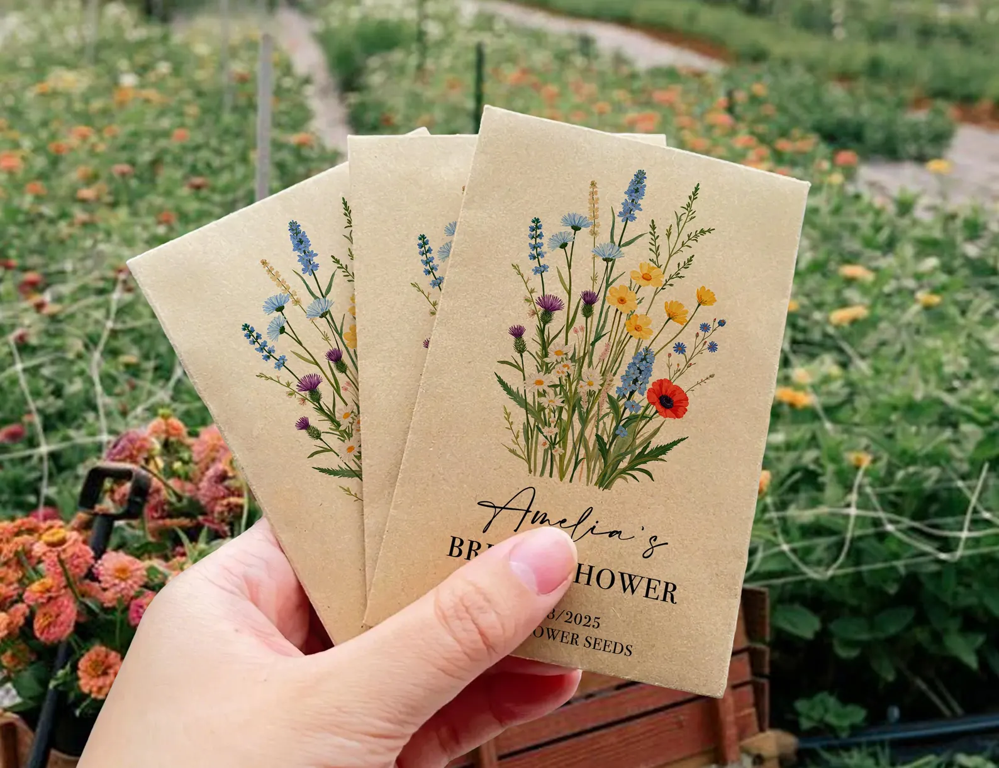

# Exercice 8. Carte produit avec bouton collé en bas

## Objectif

Créer une carte produit contenant :
- une image
- un titre
- une description
- un prix
- un bouton

## But

Comprendre comment organiser une carte en colonne avec Flexbox, et garder le bouton en bas même si la description change de longueur.

## Compétences travaillées
- `display: flex`
- `flex-direction`
- `flex-grow` ou `margin-top: auto`

## Structure HTML

```html
<div class="card">
    
    <div class="content">
        <h2>Titre du produit</h2>
        <p>Petite description du produit.</p>
        <p class="price">29,99 €</p>
        <button>Acheter</button>
    </div>
</div>
```

## Contraintes

- les éléments de la carte doivent être organisés verticalement
- la carte doit rester propre même si la description est plus longue
- le bouton doit rester collé en bas de la carte
- utiliser Flexbox pour organiser le contenu